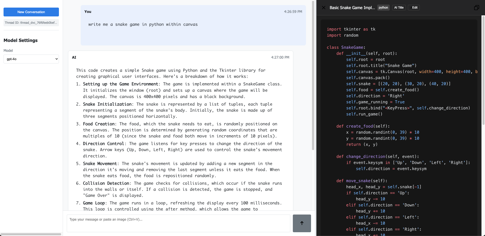

<center>

# Agent Canvas - AI Chatbot UI

[](https://reactjs.org/)
[](https://www.typescriptlang.org/)
[](https://openai.com/)
[](https://azure.microsoft.com/services/openai/)
[](https://github.com/yourusername/agent-canvas/pulls)
[](https://opensource.org/licenses/MIT)

</center>

A modern, feature-rich chatbot interface for interacting with AI models like GPT-4o, built with React and TypeScript. Agent Canvas provides an intuitive interface for AI conversations with code editing capabilities, real-time streaming responses, and advanced layout management.

## Overview

Agent Canvas is an interactive web application that provides a clean interface for conversations with AI models. It features real-time streaming responses, markdown support, and a specialized code/markdown editor canvas that enhances the experience of working with code snippets and structured content.



## Features

- **Interactive Chat Interface**: Clean, responsive design with user and AI message bubbles
- **Real-time Response Streaming**: See AI responses as they're generated
- **Automatic Task Detection**: System detects if your query is best suited for chat, code generation, or image creation
- **Code Canvas Integration**: Specialized editor for working with code snippets that opens automatically when needed
- **Advanced Model Settings**: Configure model parameters including:
  - API type (OpenAI/Azure)
  - Model selection (GPT-4o, etc.)
  - Temperature and token settings
  - Base URL and API key configuration
- **Rich Markdown Support**: Full support for markdown formatting in AI responses
- **Auto-Code Block Detection**: Automatic detection and rendering of code snippets in responses
- **In-progress Code Detection**: Identifies code blocks as they're being streamed for a better experience
- **Conversation Management**: Create and manage conversation threads with unique IDs
- **Resizable Layout**: Customize your workspace with resizable panels for chat and code
- **Message Actions**: Copy, edit, delete and regenerate message content easily
- **Mobile Responsive Design**: Works across devices of various sizes

## Technical Stack

- **Frontend**:
  - React 19 with TypeScript
  - Modern React Hooks for state management
- **Code Editing**:
  - Syntax highlighting with Prism.js
  - BlockNote for rich text editing
- **API Integration**:
  - OpenAI Chat Completions API
  - Azure OpenAI support
  - Image generation capabilities
- **Styling**: CSS with responsive design
- **Build Tools**:
  - Webpack for bundling
  - React Scripts for development workflow
- **Utilities**:
  - UUID for message/thread IDs
  - Advanced markdown processing utilities

## Modular Architecture

The codebase has been refactored into a highly modular architecture for better maintainability:

- **Message Handling Module**: Centralized message operations (copy, edit, delete, regenerate)
- **Canvas Management Module**: Code canvas operations and streaming management
- **Layout Module**: UI layout management with resizable components
- **Markdown Utilities**: Advanced markdown detection and processing
- **Model Utilities**: AI model configuration and management

## Project Structure

```
agent-canvas/
├── public/
│   ├── index.html
│   └── layout.png
├── src/
│   ├── components/
│   │   ├── ChatBox.tsx           # Main chat interface component
│   │   ├── MarkdownCanvas.tsx    # Code/markdown editor component
│   │   ├── MessageItem.tsx       # Individual message component
│   │   ├── ModelSettings.tsx     # Model configuration component
│   │   └── SelectionPopup.tsx    # Text selection popup component
│   ├── services/
│   │   └── openai.ts             # OpenAI API integration
│   ├── types/
│   │   └── index.ts              # TypeScript type definitions
│   ├── utils/
│   │   ├── canvasHandlers.ts     # Canvas management utilities
│   │   ├── layoutHandlers.ts     # UI layout management
│   │   ├── markdownUtils.ts      # Markdown processing utilities
│   │   ├── messageHandlers.ts    # Message operation utilities
│   │   └── modelUtils.ts         # Model configuration utilities
│   ├── assets/
│   │   └── icon/                 # UI icons
│   ├── App.tsx                   # Main application component
│   ├── index.tsx                 # Application entry point
│   └── styles.css                # Global styles
├── docker/
│   └── Dockerfile                # Docker container configuration
├── scripts/
│   ├── dev.js                    # Development server script
│   └── start.js                  # Production server script
├── docker-compose.yaml           # Docker compose configuration
├── package.json                  # Project dependencies
└── tsconfig.json                 # TypeScript configuration
```

## Getting Started

### Prerequisites

- Node.js (v18.x or higher recommended)
- npm or yarn

### Installation

1. Clone the repository:

   ```bash
   git clone https://github.com/yourusername/agent-canvas.git
   cd agent-canvas
   ```

2. Install dependencies:

   ```bash
   npm install
   # or
   yarn install
   ```

3. Configure environment variables: Create or edit the `.env` file in the project root:

   ```
   BASE_URL=https://api.openai.com/v1  # or your custom API endpoint
   API_KEY=your_api_key
   TEMPERATURE=0.7
   MAX_TOKENS=2048
   ```

4. Start the development server:

   ```bash
   npm run dev
   # or
   yarn dev
   ```

5. Open your browser to the displayed URL (typically `http://localhost:3000`)

### Docker Setup

For containerized deployment:

1. Build the Docker image:

   ```bash
   docker-compose build
   ```

2. Run the container:

   ```bash
   docker-compose up
   ```

3. Access the application at `http://localhost:3000`

## Usage

1. **Configure your API settings**: Click the settings panel to configure your API key and model preferences
2. **Start a conversation**: Type a message in the input field and press Send or hit Enter
3. **View code in the canvas**: When a code block appears in the AI response, it will automatically open in the Markdown Canvas for better viewing
4. **Edit and save code**: Make changes to the code in the canvas and click Save to update the message
5. **Message actions**:
   - Copy: Copy the entire message content
   - Edit: Make changes to the message
   - Delete: Remove the message from the conversation
   - Regenerate: Create a new response, optionally with a different model
6. **Create a new thread**: Click "New Conversation" to start a fresh chat thread

## API Configuration

The application supports both OpenAI and Azure OpenAI APIs. Configure these settings in the Model Settings panel:

- **API Type**: Select between OpenAI and Azure
- **Model**: Choose the AI model to use (e.g., GPT-4o, GPT-4o-mini)
- **Base URL**: API endpoint URL
- **API Key**: Your authentication key
- **Temperature**: Controls randomness (0.0-1.0)
- **Max Tokens**: Maximum response length

## Contributing

Contributions are welcome! Please feel free to submit a Pull Request.

1. Fork the repository
2. Create your feature branch (`git checkout -b feature/amazing-feature`)
3. Commit your changes (`git commit -m 'Add some amazing feature'`)
4. Push to the branch (`git push origin feature/amazing-feature`)
5. Open a Pull Request

## License

This project is licensed under the MIT License - see the [LICENSE](LICENSE) file for details.

## Acknowledgements

- Built with React and TypeScript
- Powered by OpenAI's language models
- Inspired by modern chat applications and code editors
