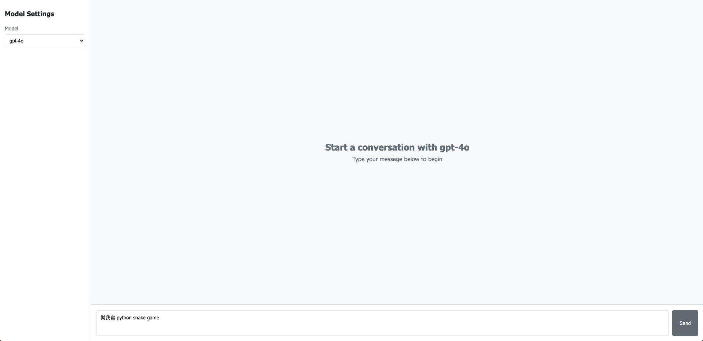

# Agent Canvas - AI Chatbot UI

A modern, feature-rich chatbot interface for interacting with AI models like GPT-4o, built with React and TypeScript.

## Overview

Agent Canvas is an interactive web application that provides a clean interface for conversations with AI models. It features real-time streaming responses, markdown support, and a specialized code/markdown editor canvas that enhances the experience of working with code snippets and structured content.



## Features

- **Interactive Chat Interface**: Clean, responsive design with user and AI message bubbles
- **Real-time Response Streaming**: See AI responses as they're generated
- **Model Settings Configuration**: Configure model parameters including:
    - API type (OpenAI/Azure)
    - Model selection (GPT-4o, etc.)
    - Temperature and token settings
    - Base URL and API key configuration
- **Markdown Support**: Rich text formatting in AI responses
- **Code Block Detection**: Automatic detection of code snippets in responses
- **Markdown Canvas**: Specialized editor for viewing and modifying code/markdown content
    - Syntax highlighting
    - Edit/Copy/Save functionality
    - Automatic title generation for code snippets
- **Mobile Responsive Design**: Works across devices of various sizes

## Technical Stack

- **Frontend**: React with TypeScript
- **State Management**: React Hooks (useState, useEffect)
- **API Integration**: OpenAI Chat Completions API
- **Styling**: CSS with responsive design
- **Utilities**: UUID for message IDs, markdown processing utilities

## Project Structure

```
agent-canvas/
├── public/
│   └── index.html
├── src/
│   ├── components/
│   │   ├── ChatBox.tsx           # Main chat interface component
│   │   ├── MarkdownCanvas.tsx    # Code/markdown editor component
│   │   ├── MessageItem.tsx       # Individual message component
│   │   └── ModelSettings.tsx     # Model configuration component
│   ├── services/
│   │   └── openai.ts             # OpenAI API integration
│   ├── types/
│   │   └── index.ts              # TypeScript type definitions
│   ├── utils/
│   │   └── markdownUtils.ts      # Markdown processing utilities
│   ├── App.tsx                   # Main application component
│   ├── index.tsx                 # Application entry point
│   └── styles.css                # Global styles
├── .env                          # Environment variables
├── package.json                  # Project dependencies
└── tsconfig.json                 # TypeScript configuration
```

## Getting Started

### Prerequisites

- Node.js (v14.x or higher)
- npm or yarn

### Installation

1. Clone the repository:

    ```bash
    git clone https://github.com/your-username/agent-canvas.git
    cd agent-canvas
    ```

2. Install dependencies:

    ```bash
    npm install
    # or
    yarn install
    ```

3. Configure environment variables:
    Create or edit the `.env` file in the project root:

    ```
    BASE_URL=https://tma.mediatek.inc/tma/sdk/api
    API_KEY=your_api_key
    TEMPERATURE=0.7
    MAX_TOKENS=2048
    ```

4. Start the development server:

    ```bash
    npm run dev
    # or
    yarn dev
    ```

5. Open your browser to the displayed URL (typically `http://localhost:3000`)

## Usage

1. **Start a conversation**: Type a message in the input field and press Send or hit Enter
2. **Configure model settings**: Click on the settings icon to adjust model parameters
3. **View code in the canvas**: When a code block is detected in an AI response, you can open it in the Markdown Canvas for a better viewing/editing experience
4. **Edit and save code**: In the Markdown Canvas, you can edit the code and save your changes

## API Configuration

The application supports both OpenAI and Azure OpenAI APIs. Configure these settings in the Model Settings panel:

- **API Type**: Select between OpenAI and Azure
- **Model**: Choose the AI model to use (e.g., GPT-4o, GPT-4o-mini)
- **Base URL**: API endpoint URL
- **API Key**: Your authentication key
- **Temperature**: Controls randomness (0.0-1.0)
- **Max Tokens**: Maximum response length

## License

[MIT License]

## Acknowledgements

- Built with React and TypeScript
- Powered by OpenAI's language models
- MediaTek APIs integration
